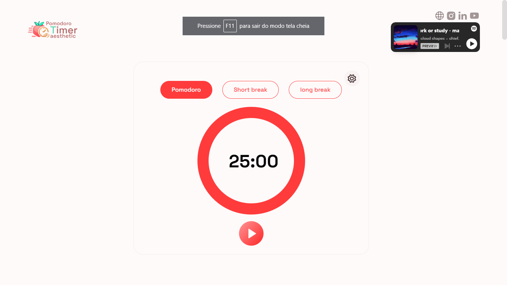

# Pomodoro Timer Aesthetic

O Pomodoro Timer Aesthetic é uma abordagem estilizada do popular método de gerenciamento de tempo chamado Técnica Pomodoro. Esta ferramenta visa não apenas melhorar sua produtividade, mas também criar uma experiência visualmente agradável durante os períodos de trabalho e descanso.

## Tecnologia Utilizada

O Pomodoro Timer Aesthetic foi desenvolvido utilizando as seguintes tecnologias:

- Linguagem de Programação: JavaScript
<!-- - Framework Front-End: React -->
- Biblioteca de Estilos: CSS
<!-- - Gerenciamento de Estado: Redux -->
- Temporizadores e Notificações: HTML5 APIs

## Recursos

- Divisão de Trabalho em Pomodoros de 25 minutos, seguidos por pausas curtas.
- poder editar os intervalos do pomodoro.
- Sons Relaxantes ou Música de Fundo para uma experiência auditiva agradável.
- Personalização e Sons de acordo com as preferências do usuário.
- Temporizador Automático para alternar automaticamente entre Pomodoros e pausas.

## Demo

Demo on netlify: https://pomodorotimeraesthetic.netlify.app/
